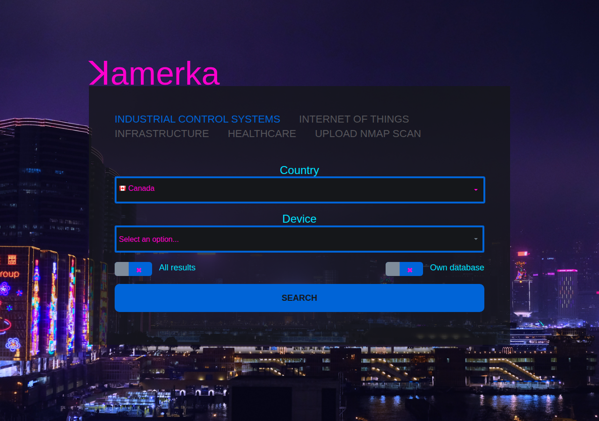
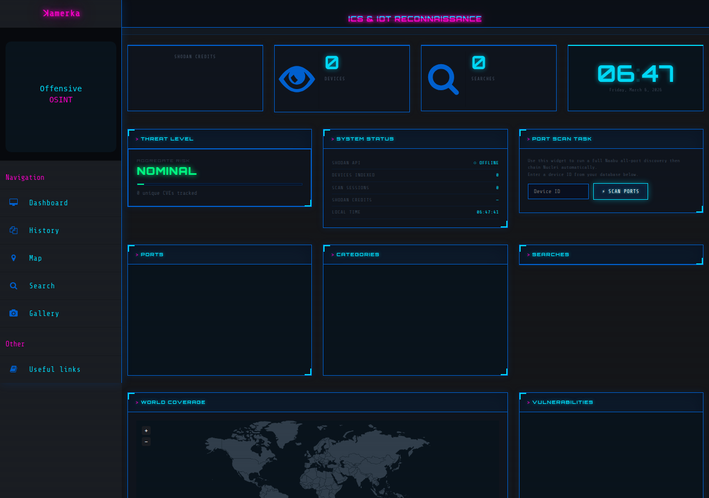
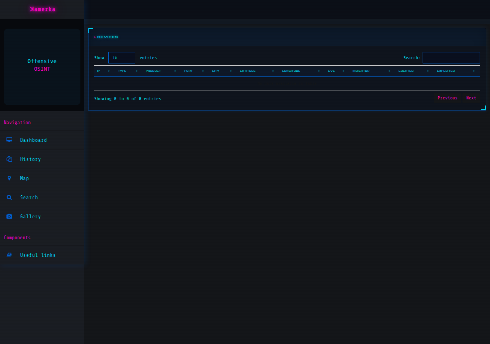
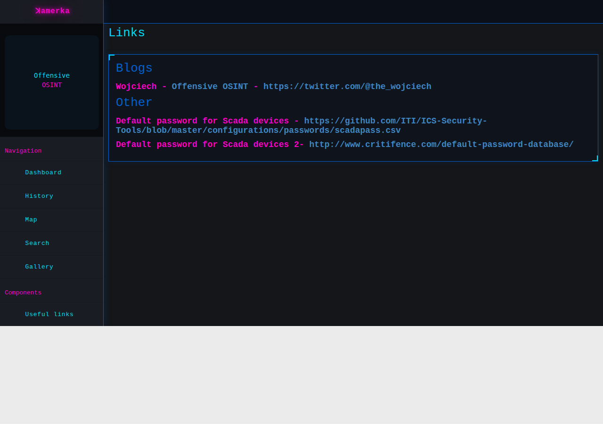

# ꓘamerka Plus GUI

## Ultimate Internet of Things & Industrial Control Systems reconnaissance tool. Upgraded Edition

[](https://github.com/webmaster-exit-1/Kamerka_Plus_GUI/actions/workflows/ci.yml)


### Powered by Shodan

## What's New in the Plus Edition

This is a modernized fork of the original [Kamerka-GUI](https://github.com/woj-ciech/Kamerka-GUI) with the following major changes:

- **Leaflet.js + OpenStreetMap** replaces Google Maps — no API key required, no cost, fully open-source (BSD-2-Clause)
- **WHOIS Lookup** via the FOSS [`ipwhois`](https://pypi.org/project/ipwhois/) library — no API key required, uses standard RDAP/WHOIS servers
- **Nuclei vulnerability scanning** with 12 custom templates targeting China-IoT devices (Hikvision, Dahua, Huawei, ZTE)
- **Wappalyzer integration** for web technology fingerprinting of discovered devices
- **RTSP stream scanning** for camera devices
- **CSV and KML export** for search results — load directly into QGIS, Kepler.gl, uMap, or the built-in globe
- **Celery progress tracking** with real-time task status in the UI
- **Comprehensive test suite** covering models, views, URL patterns, exports, and scanning tasks
- **API keys via environment variables** — no more `keys.json`
- **Native 3D globe viewer** (PyVista + PyQt6) with textured Earth, device spikes, LOD clustering, and click-to-inspect
- **Tiered verification pipeline**: InternetDB (free) → Naabu → Shodan, with credit cost reporting
- **Honeypot cluster detection**: filters /24 subnets with ≥ 500 identical banners before rendering
- **Android / Termux support** — runs without root on Android 14 (tested on OnePlus CPH2583)

## Documentation

| Document | Description |
| ---------- | ------------- |
| [docs/INSTALL.md](docs/INSTALL.md) | Full installation guide, environment variables, API keys (Shodan, NVD, Pastebin), external tools (Nmap, Nuclei, Naabu), PostgreSQL setup, Android/Termux |
| [docs/ARCHITECTURE.md](docs/ARCHITECTURE.md) | 3D globe, verification pipeline, tool path configuration, Celery/Redis architecture |
| [docs/DATABASE.md](docs/DATABASE.md) | SQLite WAL concurrency mitigations and PostgreSQL migration guide |

## Features

- More than 100 ICS device queries
- Interactive maps powered by Leaflet.js and OpenStreetMap (no API key needed)
- Native 3D globe viewer (PyVista + PyQt6) with textured Earth, device spikes, and LOD clustering
- Nuclei vulnerability scanning with custom China-IoT templates
- WHOIS lookups powered by the FOSS `ipwhois` library (no API key required)
- Wappalyzer web technology detection
- RTSP camera stream scanning
- CSV and KML export for search results — compatible with QGIS, Kepler.gl, uMap, and the built-in globe
- Gallery section shows every gathered screenshot in one place
- Celery task progress tracking in the UI

## Quick Start

```bash
git clone https://github.com/webmaster-exit-1/Kamerka_Plus_GUI.git
cd Kamerka_Plus_GUI
pip3 install -r requirements.txt
export SHODAN_API_KEY=your_key_here
# Optional: export NVD_API_KEY=your_nvd_key_here  (see docs/INSTALL.md)
redis-server &
python3 manage.py migrate
python3 manage.py create_default_superuser
python3 manage.py runserver &
# Run the Celery worker as root — required for Nmap raw-socket scans (-sS, -O)
# Execute this command as the root user (or from a root shell)
celery --app kamerka worker --loglevel=info
```

See [docs/INSTALL.md](docs/INSTALL.md) for the full installation guide, including
PostgreSQL setup, Pastebin API configuration, NVD API keys, and external tool
(`nmap`, `nuclei`, `naabu`) environment variables.

## NSA and CISA Advisory

> Shodan, Kamerka, are creating a "perfect storm" of
>
> 1) easy access to unsecured assets,
>
> 2) use of common, open-source information about devices, and
>
> 3) an extensive list of exploits deployable via common exploit frameworks (e.g., Metasploit, Core Impact, and Immunity Canvas).

<https://us-cert.cisa.gov/ncas/alerts/aa20-205a>

## Screenshots

### Search



### Dashboard



### Devices



### Map (Leaflet + OpenStreetMap)



## Articles

<https://www.offensiveosint.io/hack-the-planet-with-amerka-gui-ultimate-internet-of-things-industrial-control-systems-reconnaissance-tool/>

<https://www.offensiveosint.io/offensive-osint-s01e03-intelligence-gathering-on-critical-infrastructure-in-southeast-asia/>

<https://www.offensiveosint.io/hack-like-its-2077-presenting-amerka-mobile/>

<https://www.zdnet.com/article/kamerka-osint-tool-shows-your-countrys-internet-connected-critical-infrastructure/>

<https://www.icscybersecurityconference.com/intelligence-gathering-on-u-s-critical-infrastructure/>

## Full list of supported devices

<https://github.com/webmaster-exit-1/Kamerka_Plus_GUI/blob/master/queries.md>

## License

MIT License — see [LICENSE.md](LICENSE.md) for details.

## Additional

- I'm not responsible for any damage caused by using this tool.
