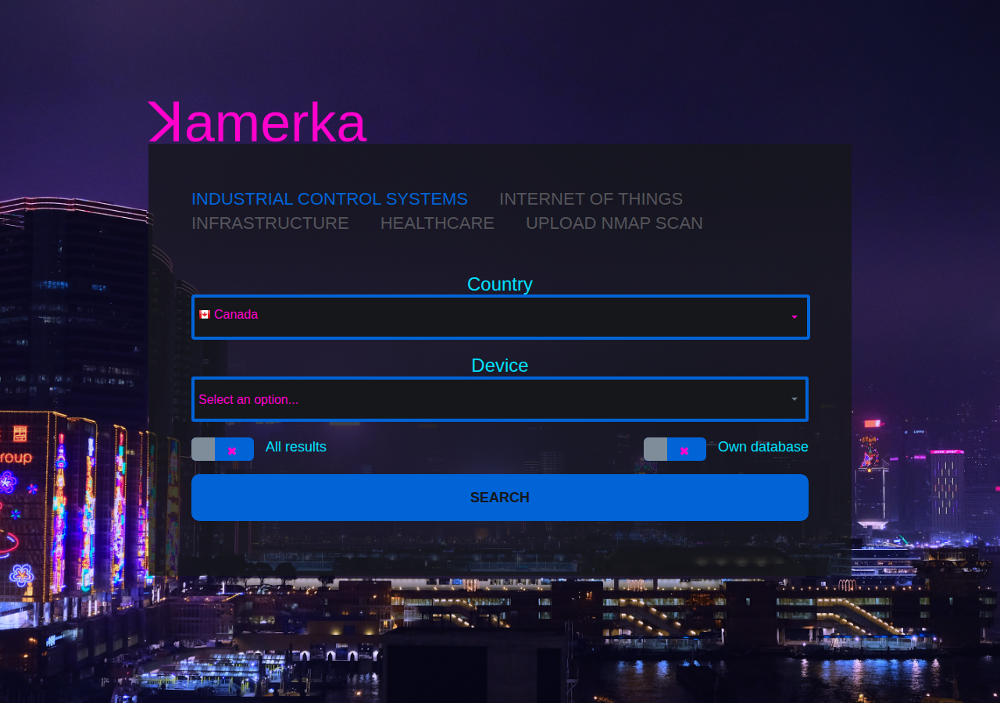
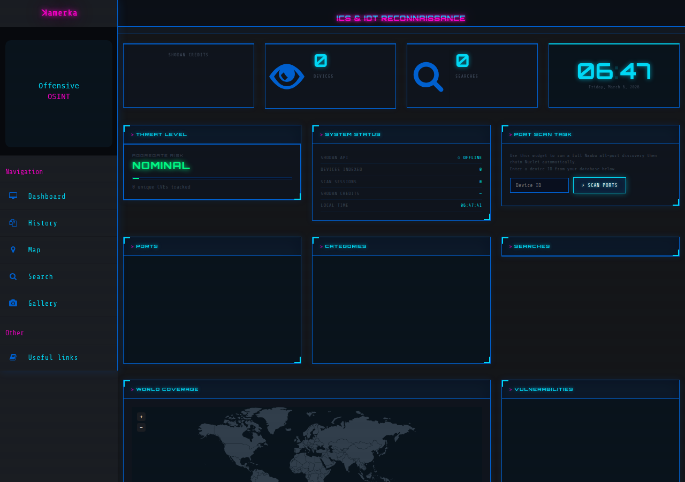
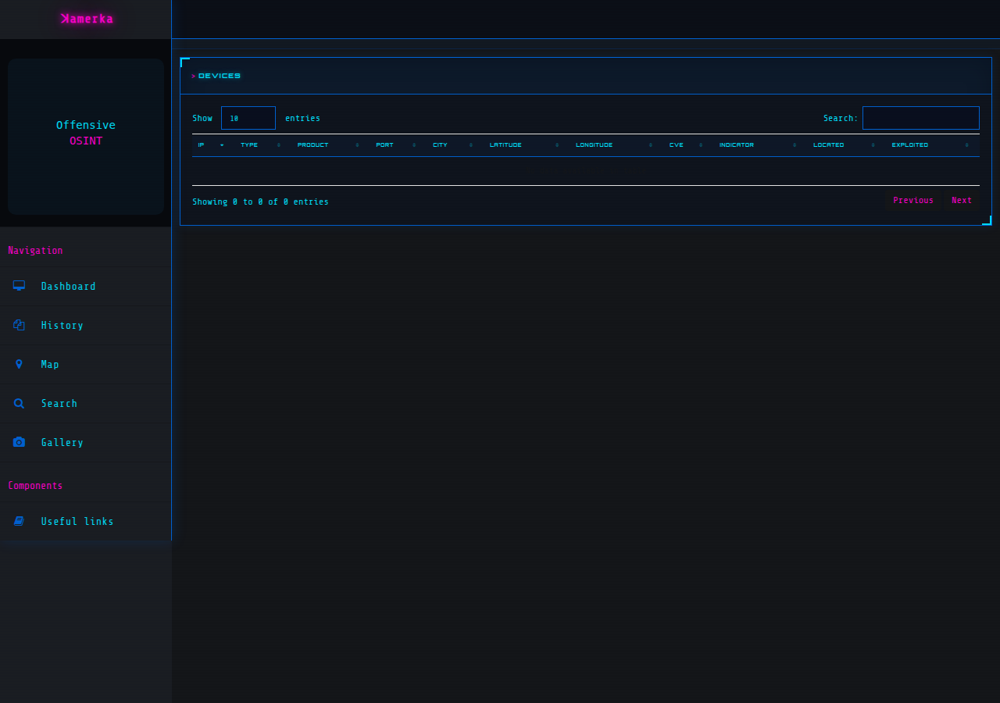
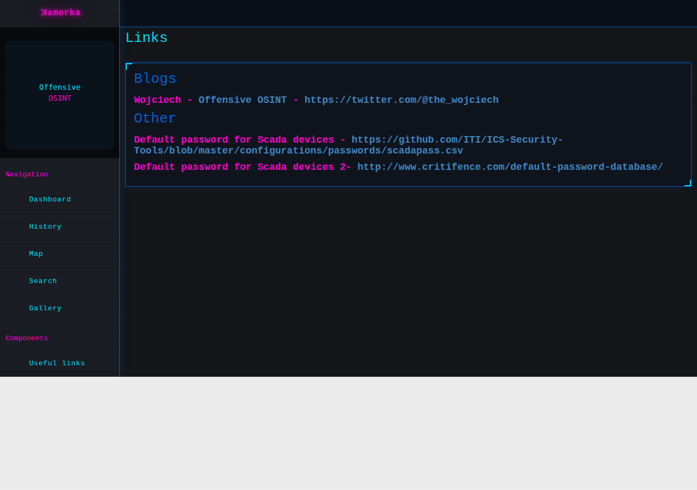

# ꓘamerka Plus GUI

**Ultimate Internet of Things & Industrial Control Systems reconnaissance platform — upgraded edition**

[](https://github.com/webmaster-exit-1/Kamerka_Plus_GUI/actions/workflows/ci.yml)


### Powered by Shodan · enriched with OSINT feeds, layers, and optional local AI

Modernized fork of [Kamerka-GUI](https://github.com/woj-ciech/Kamerka-GUI) for analysts who want **cases → maps → device workbench → exports** in one cyberpunk-styled web UI, with background scanning on Celery and Redis.

---

## What's new in this edition

| Area | Highlights |
|------|------------|
| **Maps** | **2D** Leaflet + OpenStreetMap (no API key). **3D** [`/map3d`](http://127.0.0.1:8000/map3d) via MapLibre + [OpenFreeMap](https://openfreemap.org/) by default; optional `MAPBOX_ACCESS_TOKEN` for richer building meshes. GeoJSON / KML / CSV exports for QGIS, Kepler.gl, SandDance. Legacy `/globe` redirects to the web 3D map; optional **PyVista + PyQt6** desktop globe still available. |
| **Intel** | RSS/Atom ingestion (`feedparser`), OPML import (bundled + your Feeder export), **Feed Intel** panel + **Region Brief** (Ollama or extractive summariser). Plain-text briefs — no raw HTML tags in the UI. |
| **Workbench** | Per-device tools: Nmap, Nuclei, Wappalyzer, RTSP, Shodan intel, NVD/NRICH, honeypot heuristics, screenshots, ExploitDB, bulk actions, risk score + layer context. |
| **HexSploit** | Optional [HexStrike](https://github.com/0x4m4/hexstrike-ai) bridge at `/hexsploit/` — health, tool catalog, smart scan (requires local HexStrike server). |
| **Ops** | Celery progress in UI, **Tasks** registry with orphan/stale reconciliation, watchlists, setup health check, Fish stack helpers under `scripts/`. |
| **Verification** | Tiered pipeline: InternetDB (free) → Naabu → Shodan, with credit reporting; honeypot cluster filtering on dense /24 banners. |
| **Security & config** | API keys via environment / `.env` (no `keys.json`); interactive [`scripts/install_kamerka.py`](scripts/install_kamerka.py) wizard; 225+ automated tests. |

---

## Documentation

| Document | Description |
|----------|-------------|
| [docs/INSTALL.md](docs/INSTALL.md) | Full install, `.env` / API keys, external tools (Nmap, Nuclei, Naabu, Wappalyzer), PostgreSQL, Android/Termux |
| [docs/ARCHITECTURE.md](docs/ARCHITECTURE.md) | Celery/Redis, verification pipeline, tool paths, map layers |
| [docs/DATABASE.md](docs/DATABASE.md) | SQLite WAL notes and PostgreSQL migration |
| [docs/docker.md](docs/docker.md) | Docker Compose stack (web, Redis, Celery, beat, optional Postgres) |
| [docs/WORLDMONITOR_INTEGRATION.md](docs/WORLDMONITOR_INTEGRATION.md) | Feed layers, SSE, briefs, and layer architecture (WorldMonitor-inspired, original code) |

---

## Features

- **100+ ICS / IoT Shodan queries** — see [queries.md](queries.md)
- **Case-centric workflow** — search → results map → device workbench → exports
- **2D map** — Leaflet + OSM, no map API bill
- **3D map** — heatmap, 3D columns, buildings layer; free basemap out of the box
- **OSINT RSS** — import OPML, hourly refresh, geo-tagged entries, regional AI briefs
- **Vulnerability & recon tools** — Nuclei (incl. China-IoT templates), WHOIS (`ipwhois`), Wappalyzer, RTSP, port scans
- **Gallery & camera wall** — screenshots and RTSP discoveries in one place
- **Paginated device registry** — `/devices` scales to thousands of rows
- **Task audit trail** — `/tasks` syncs with Celery; stale/orphan jobs auto-marked failed
- **Watchlists** — scheduled Shodan re-runs
- **Exports** — CSV, KML, JSON, GeoJSON for cases and 3D map

---

## Quick start (recommended)

**Requirements:** Python 3.10+, Redis, Shodan API key. Optional: Nmap, Nuclei, Naabu, Ollama, HexStrike.

```bash
git clone https://github.com/webmaster-exit-1/Kamerka_Plus_GUI.git
cd Kamerka_Plus_GUI

# Guided setup: .env, migrations, superuser, seed layers + bundled feeds
python3 scripts/install_kamerka.py --venv

# Load secrets (or use fish/bash profile exports)
set -a && source .env && set +a   # bash
# fish: export from ~/.config/fish/config.fish or source .env manually

redis-server &   # or: docker run -p 6379:6379 redis:7-alpine

# Terminal 1 — Django
python3 manage.py runserver 127.0.0.1:8000

# Terminal 2 — Celery worker + beat (feeds, layers, watchlists, task reconcile)
celery --app kamerka worker --beat --loglevel=info
```

**Open:** [http://127.0.0.1:8000/](http://127.0.0.1:8000/) (search) · [http://127.0.0.1:8000/index](http://127.0.0.1:8000/index) (overview + Feed Intel / Region Brief) · [http://127.0.0.1:8000/map3d](http://127.0.0.1:8000/map3d)

### Import your RSS feeds (Feeder OPML)

```bash
python3 manage.py import_feeds_opml /path/to/feeder-export.opml
# Optional: deactivate sources not in this file
python3 manage.py import_feeds_opml /path/to/export.opml --deactivate-missing
```

### Fish helpers (optional)

```bash
fish scripts/kamerka.fish runserver
fish scripts/kamerka.fish worker
fish scripts/start_stack.fish      # tmux-style stack
fish scripts/start_hexstrike.fish  # HexStrike for HexSploit
```

### Reconcile stuck tasks

If **Tasks** shows many old `pending` rows (worker was down or Redis lost results):

```bash
python3 manage.py reconcile_task_runs
```

---

## Quick start (Docker)

```bash
cp .env.example .env
# Edit SHODAN_API_KEY, DJANGO_SECRET_KEY, etc.
docker compose --profile postgres up --build
```

See [docs/docker.md](docs/docker.md) for profiles, volumes, and migrations.

---

## Key URLs

| Path | Purpose |
|------|---------|
| `/` | New search (country, coords, healthcare, Nmap upload) |
| `/index` | Overview dashboard, charts, Feed Intel, Region Brief |
| `/history` | Cases |
| `/devices` | All devices (paginated, searchable) |
| `/map` | 2D Leaflet map |
| `/map3d` | 3D MapLibre map + exports |
| `/tasks` | Celery task runs |
| `/hexsploit/` | HexStrike integration UI |
| `/api/feeds/entries/` | RSS JSON API |
| `/api/feeds/brief/<ISO2>/` | Regional intelligence brief |

---

## Environment variables (essentials)

Copy [`.env.example`](.env.example) to `.env`. Minimum for searches:

```bash
SHODAN_API_KEY=your_key_here
DJANGO_SECRET_KEY=your_long_random_secret
REDIS_URL=redis://localhost:6379
```

| Variable | Purpose |
|----------|---------|
| `SHODAN_API_KEY` | Required for Shodan searches and scans |
| `NVD_API_KEY` | Optional — higher NVD rate limits |
| `OLLAMA_HOST` | Optional — AI region briefs (`http://localhost:11434`) |
| `MAPBOX_ACCESS_TOKEN` | Optional — enhanced 3D buildings on `/map3d` |
| `HEXSTRIKE_SERVER_URL` | Optional — HexSploit backend (default `http://127.0.0.1:8888`) |
| `TASK_RUN_STALE_MINUTES` | Mark orphaned pending tasks failed (default `90`) |

Full list: [docs/INSTALL.md](docs/INSTALL.md) and `.env.example`.

---

## NSA and CISA advisory

> Shodan, Kamerka, are creating a "perfect storm" of
>
> 1) easy access to unsecured assets,
>
> 2) use of common, open-source information about devices, and
>
> 3) an extensive list of exploits deployable via common exploit frameworks (e.g., Metasploit, Core Impact, and Immunity Canvas).

<https://us-cert.cisa.gov/ncas/alerts/aa20-205a>

**Use only on systems you are authorised to assess.**

---

## Screenshots

### Search



### Dashboard



### Devices



### Map (Leaflet + OpenStreetMap)



---

## Articles

- <https://www.offensiveosint.io/hack-the-planet-with-amerka-gui-ultimate-internet-of-things-industrial-control-systems-reconnaissance-tool/>
- <https://www.offensiveosint.io/offensive-osint-s01e03-intelligence-gathering-on-critical-infrastructure-in-southeast-asia/>
- <https://www.offensiveosint.io/hack-like-its-2077-presenting-amerka-mobile/>
- <https://www.zdnet.com/article/kamerka-osint-tool-shows-your-countrys-internet-connected-critical-infrastructure/>
- <https://www.icscybersecurityconference.com/intelligence-gathering-on-u-s-critical-infrastructure/>

---

## Supported device queries

<https://github.com/webmaster-exit-1/Kamerka_Plus_GUI/blob/master/queries.md>

---

## License

MIT License — see [LICENSE.md](LICENSE.md).

---

## Disclaimer

The author is not responsible for any damage caused by misuse of this tool. Reconnaissance and scanning must comply with applicable law and scope agreements.